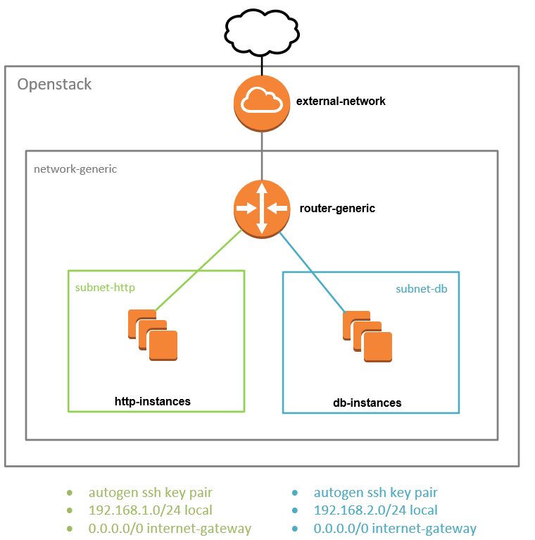

# How to



### Create stack

```
terraform apply
```

This script will create:
-   1 router
-   2 networks
-   2 http instances
-   3 db instances

The number of db instance will be define with Terraform "count" parameters

### Delete stack

```
terraform destroy
```
